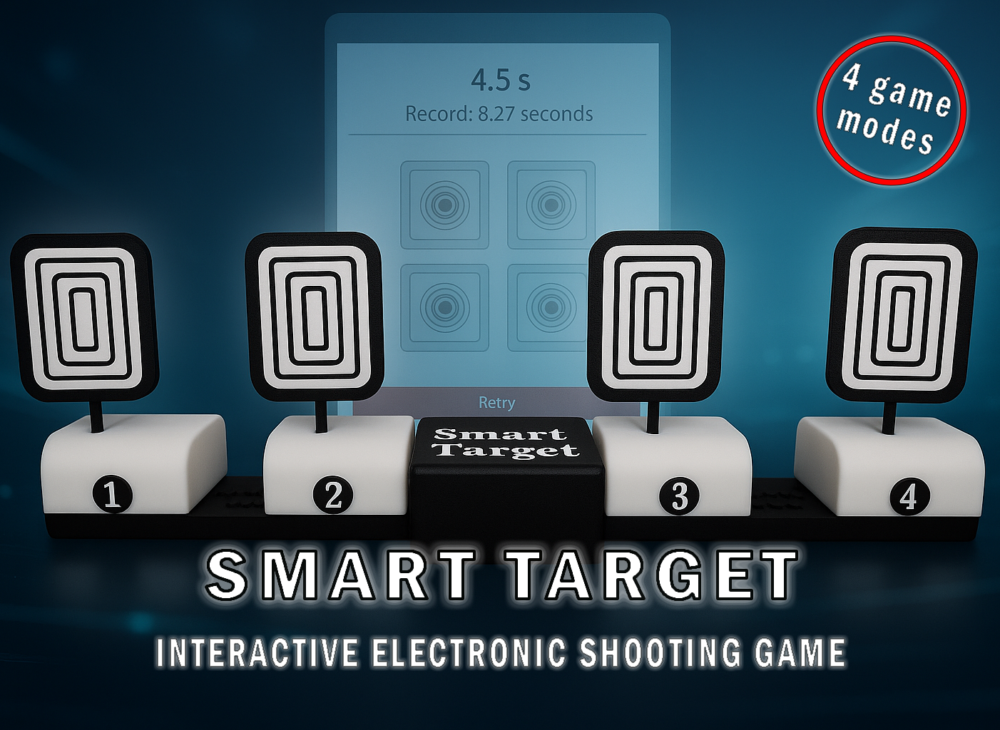

# 🎯 Smart Target – Firmware

Interactive electronic target system by **DGVeLab**

Smart Target is an interactive electronic target system designed for reaction training, shooting practice, and technical experimentation.

The system uses microcontrollers to control moving targets, manage game logic, and create dynamic training scenarios.

This repository contains **only the firmware** used by the Smart Target system.

The **mechanical parts, assembly instructions, and printable components** are available on the Maker platforms.

---

# 🔗 Full Project

Complete project pages:

• [MakerWorld](https://makerworld.com/en/@DGVeLab)
• [MakerOnline](https://www.makeronline.com/en/user/personalInfo/7659f18f-330a-4e56-b98a-202a323bc26e.html?trackUserType=1)

These pages include:

- STL files
- assembly instructions
- project photos
- printing recommendations

---

# ⚙️ Firmware Overview

The firmware manages the main logic of the Smart Target system:

• Target activation and movement  
• Game sequence logic  
• Timing and event management  
• Communication between modules  
• Control of servos, sensors and LEDs  

The firmware runs on **ESP-based microcontrollers**.

---

# 📥 Download Firmware

Precompiled firmware files are available in the **Releases** section of this repository.

➡ Go to **Releases** to download the latest version.

---

# 🔧 Flashing the Firmware

To program the device you must use:

**ESPprogrammer**

Download it here:

➡ [ESPprogrammer](https://github.com/DGVeLab/ESP-Programmer)

ESPprogrammer allows easy flashing of ESP32 / ESP8266 devices and is recommended for Smart Target installation.

Basic steps:

1. Connect the device to your computer via USB  
2. Open **ESPprogrammer 2**  
3. Select the correct COM port  
4. Load the firmware file  
5. Flash the device  

---

# 🧰 Hardware Platform

Smart Target is designed for ESP-based development boards.

Typical configuration includes:

• ESP32 microcontroller  
• servo motor for target movement  
• optical endstop

Full hardware details are available on the Maker platforms.

---

# 🛠 DGVeLab Project

Smart Target is part of the **DGVeLab experimental maker ecosystem**, focused on:

• DIY electronics  
• functional engineering projects  
• interactive systems  
• 3D printable devices  

More projects available on MakerWorld.

---

# 👤 Author

**Ernesto – DGVeLab**

Maker, electronics enthusiast, and creator of functional DIY hardware projects.

---

# 📜 License

This firmware is released under the **DGVeLab Non-Commercial License**.

Personal and educational use are allowed.  
Commercial use requires permission from the author.
